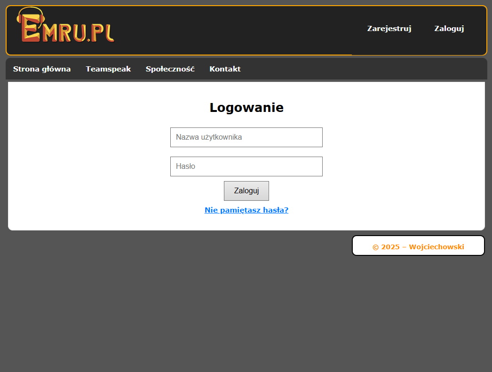
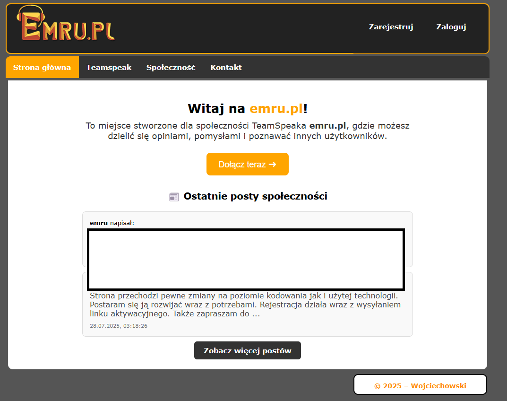
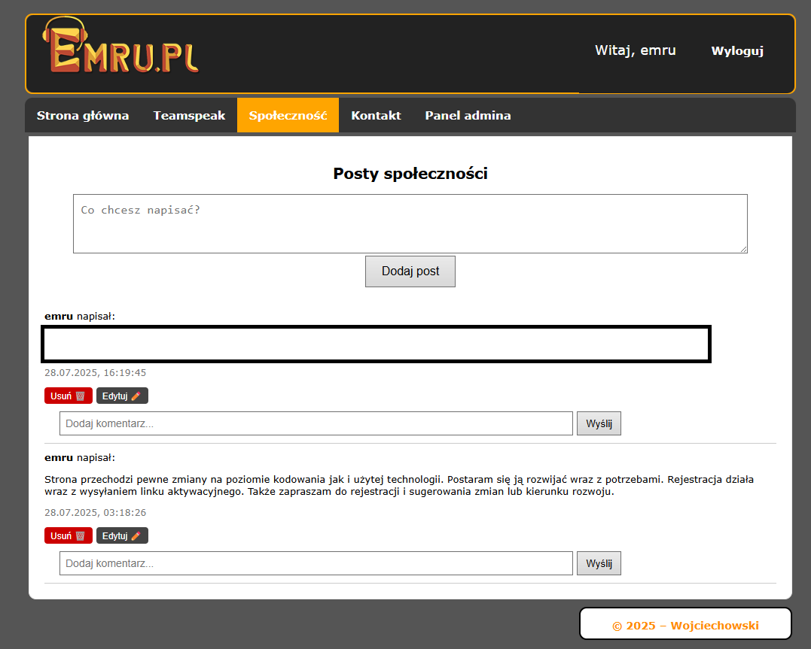

# 🌐 emru.pl – Społecznościowa strona TeamSpeaka

emru.pl to platforma społecznościowa stworzona dla użytkowników serwera TeamSpeak **emru.pl**, umożliwiająca rejestrację, logowanie, publikowanie postów i komentarzy, panel administracyjny oraz integrację z serwerem TS3.  

---

## 🚀 Funkcje
- 🔑 **System logowania i rejestracji** (JWT, aktywacja konta e-mailem)  
- 📝 **Posty i komentarze** z edycją i usuwaniem (BBCode + parser bezpieczny przed XSS)  
- 👤 **Panel administracyjny** (zarządzanie użytkownikami, postami i komentarzami)  
- 🔐 **Przypomnienie i reset hasła** z linkiem wysyłanym na e-mail  
- 🎙️ **Integracja z TeamSpeak 3** (lista użytkowników online, uptime serwera, wersja)  
- 📧 Formularz kontaktowy z wysyłką wiadomości e-mail  
- 🎨 Responsywny frontend w **React + Vite**  
- ⚙️ Backend API w **Node.js + Express** połączony z bazą **PostgreSQL**

---

## 🖼️ Screeny (dodaj własne)
### 🔑 Ekran logowania


### 🏠 Strona główna


### 📝 Posty społeczności


### 👤 Teamspeak


---

## 🛠️ Technologie
**Frontend:**
- React 18 (Vite)
- React Router
- CSS (custom styles)

**Backend:**
- Node.js + Express
- PostgreSQL (pg)
- JWT (autoryzacja)
- Nodemailer (SMTP)
- bcrypt (hashowanie haseł)
- ts3-nodejs-library (TeamSpeak 3 API)

---

## 🔧 Instalacja i uruchomienie

### 1️⃣ Klonowanie repozytorium
```bash
git clone https://github.com/twoj-login/emru.pl.git
cd emru.pl
```

### 2️⃣ Backend
```bash
cd backend
npm install
```
Utwórz plik \`.env\` (na podstawie \`.env.example\`) i uzupełnij danymi:
```env
DB_USER=
DB_PASS=
DB_HOST=
DB_NAME=
DB_PORT=
JWT_SECRET=
SMTP_HOST=
SMTP_PORT=
SMTP_SECURE=
OVH_SMTP_USER=
OVH_SMTP_PASS=
CLIENT_URL=http://localhost:5173
TS3_HOST=
TS3_QUERY_PORT=
TS3_SERVER_PORT=
TS3_QUERY_USER=
TS3_QUERY_PASS=
```

Uruchom backend:
```bash
npm run dev
```
(Domyślnie działa na \`http://localhost:3001\`)

### 3️⃣ Frontend
```bash
cd frontend
npm install
```
Utwórz plik \`.env\`:
```env
VITE_API_URL=http://localhost:3001
```

Uruchom frontend:
```bash
npm run dev
```
(Domyślnie działa na \`http://localhost:5173\`)

---

## 🔒 Bezpieczeństwo
- Sekrety są przechowywane w \`.env\` (nie commituj go!).  
- Hasła są hashowane bcryptem.  
- Autoryzacja oparta na JWT z rolami (\`user\`, \`admin\`).  
- Parser BBCode zabezpiecza przed XSS.  

---

## 🌍 Demo
🔗 [emru.pl](https://emru.pl) – działająca wersja produkcyjna  

---

## 🏗️ Struktura projektu
```
emru.pl/
│
├── backend/          # Node.js + Express API
│   ├── index.js       # Główny serwer Express
│   ├── db.js          # Połączenie z PostgreSQL
│   └── ...
│
├── frontend/         # React + Vite
│   ├── src/
│   │   ├── pages/    # Widoki: Login, Register, Feed, AdminPanel, ...
│   │   ├── components/ # Layout, Navbar, Post, ...
│   │   └── context/  # UserContext (JWT)
│   └── vite.config.js
│
└── README.md
```
---

Struktura bazy danych:
```
Tabela users

id (PK, SERIAL)

username (LOWERCASE)

display_name (oryginalna forma)

email (LOWERCASE)

password (HASHED)

activation_token (NULL po aktywacji)

is_active (BOOLEAN)

role (user / admin)

Tabela messages (posty)

id (PK, SERIAL)

user_id (FK → users.id)

message (TEXT)

sent_at (TIMESTAMP, NOW() przy dodaniu)

Tabela comments (komentarze)

id (PK, SERIAL)

message_id (FK → messages.id)

user_id (FK → users.id)

content (TEXT)

created_at (TIMESTAMP, NOW() przy dodaniu)
```

---

## 📩 Kontakt
👤 **Autor:** Wojciechowski  
🌐 Strona: [https://wojciechowski.emru.pl](https://wojciechowski.emru.pl)  
